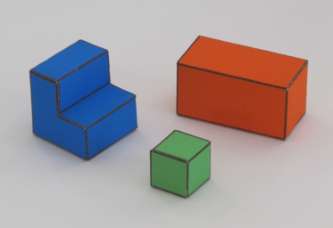

# Problem 1. A simple image formation model (10pts)
The goal of this first exercise is to take images with different settings of a camera to create pictures with perspective projection and with orthographic projection. Both pictures should cover the same piece of the scene. You can take pictures of real places (e.g., the street, a living room, ...) or you can also create your own simple world (e.g., you can print simpleWorld.pdf and create your own scenes. I recommend printing on mate paper). To create pictures with orthographic projection you can do two things:

(1) use the zoom of the Digital camera
(2) crop the central part of a picture

You will have to play with the distance between the camera and the scene, and with the zoom (or amount of cropping) so that both images look as similar as possible only differing in the type of projection (similar to figure 1.4, in the lecture 1 notes). Submit the two pictures and label out clearly which parts of the images reveal their projection types.

## Perspective Projection

## Orthographic Projection

# Problem 2. Orthographic projection (10pts)
Prove the projection equations (eq. 1.2 and 1.3 in chapter_01_simplesystem.pdf) that relate the coordinates of one point in 3D world and the image coordinates of the projection of the point in the camera plane.   You can use drawings or sketches if necessary.

# Problem 3. Constraints (10pts)
In the Lecture slide, we have written all the derivative constraints for Y(x,y). Write the constraints for Z(x,y).

# Problem 4. Approximation of derivatives (10pts)
Fill the missing kernels (lines 51 and 65 in Build Constraints) in the script *SimpleWorld.ipynb*.
Please include your answers also in the report.

# Problem 5. Run the code (10pts)
Select some of the images included with the code and show some new view points on them. You can also try with new images taken by you if you decide to create your own simple world.

# Problem 6. Violating simple world assumptions (5pts)
Find one example from the four images provided with the problem set (img1.jpg, ..., img4.jpg) when the recovery of 3D information fails. Include the image and the reconstruction in your writeup, and explain why it fails.

- According to the given photo img1, we cannot use mathematical methods to recover 3D information from this 2D image. Because the 2D image gives us two known vectors, but in 3D world, we have three unknown vectors. In other words, we need to use x, y to derive X, Y and Z, which does not make sense, meaning that we fail to utilize mathematical methods to solve it.

# Problem 7. The real world (Extra 5pts)
A research problem is a question for which we do not know the answer. In fact, there might
not even be an answer. This question is optional and could be extended into a larger course
project.\

The goal of this problem is to test the 3D reconstruction code with real images. A number
of the assumptions we have made will not work when the input are real images of more
complex scene. For instance, the simple strategy of differentiating between foreground and
background segmentation will not work with other scenes.\

Try taking pictures of real-world scenes (not the cubes) and propose modifications to the
scheme proposed in this lecture so that you can get some better 3D reconstructions. The goal
is not to build a general system, but to be able to handle a few more situations.\