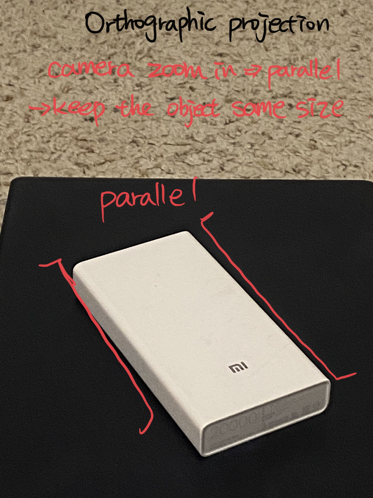

# Problem 1. A simple image formation model (10pts)
The goal of this first exercise is to take images with different settings of a camera to create pictures with perspective projection and with orthographic projection. Both pictures should cover the same piece of the scene. You can take pictures of real places (e.g., the street, a living room, ...) or you can also create your own simple world (e.g., you can print simpleWorld.pdf and create your own scenes. I recommend printing on mate paper). To create pictures with orthographic projection you can do two things:

(1) use the zoom of the Digital camera
(2) crop the central part of a picture

You will have to play with the distance between the camera and the scene, and with the zoom (or amount of cropping) so that both images look as similar as possible only differing in the type of projection (similar to figure 1.4, in the lecture 1 notes). Submit the two pictures and label out clearly which parts of the images reveal their projection types.

- **Perspective Projection**

- **Orthographic Projection**

# Problem 2. Orthographic projection (10pts)
Prove the projection equations (eq. 1.2 and 1.3 in chapter_01_simplesystem.pdf) that relate the coordinates of one point in 3D world and the image coordinates of the projection of the point in the camera plane.   You can use drawings or sketches if necessary.

# Problem 3. Constraints (10pts)
In the Lecture slide, we have written all the derivative constraints for Y(x,y). Write the constraints for Z(x,y).