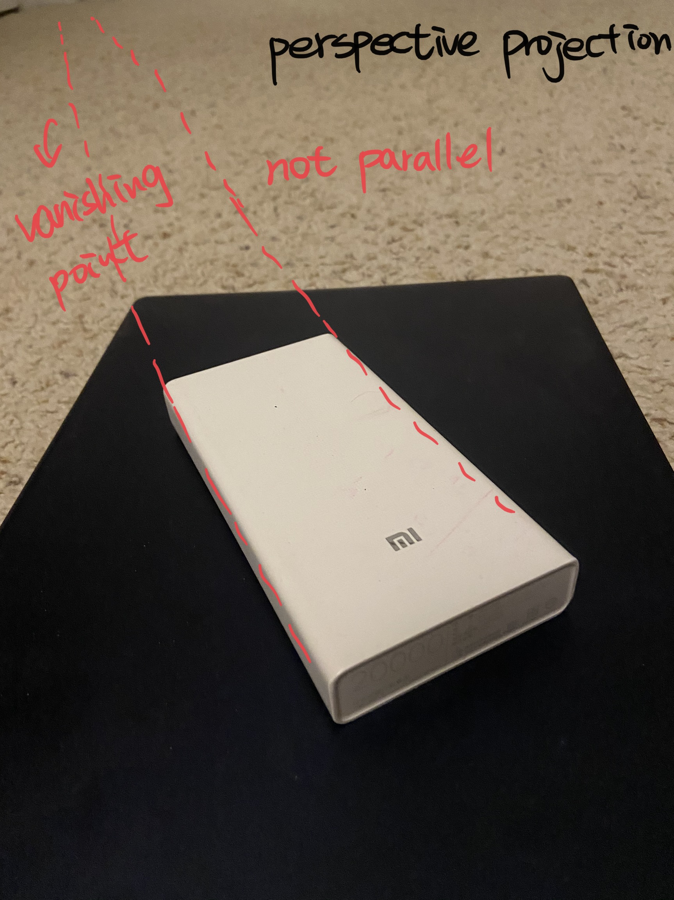
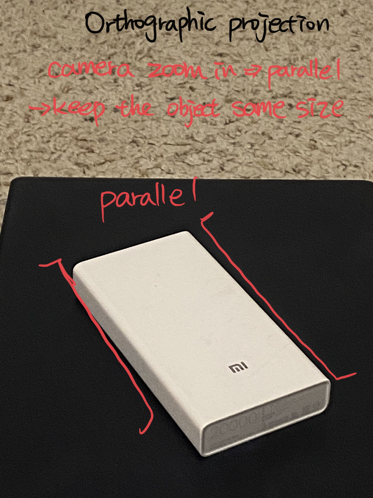
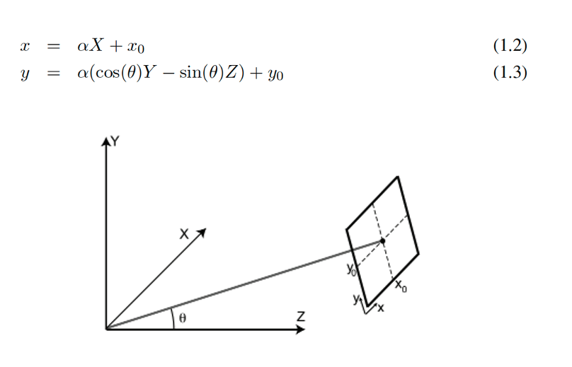
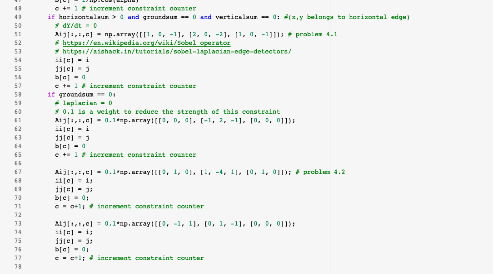
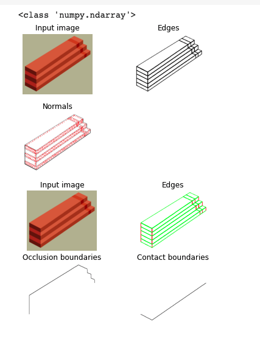
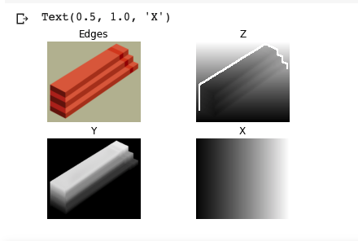
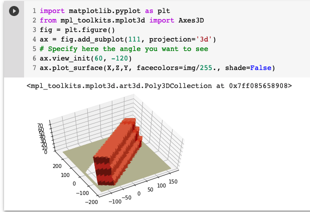
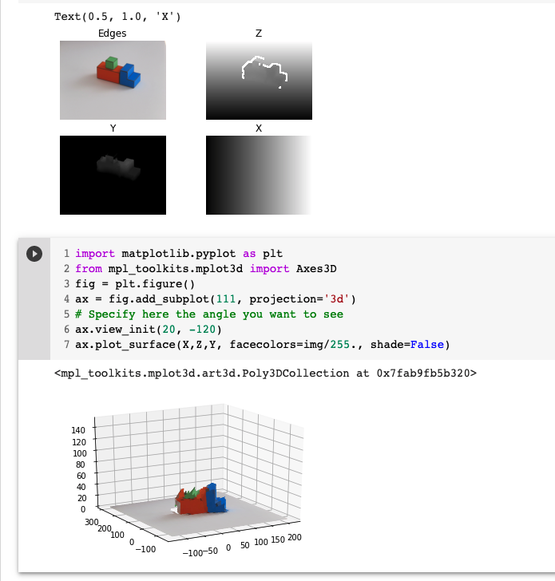

# Problem 1. A simple image formation model (10pts)
The goal of this first exercise is to take images with different settings of a camera to create pictures with perspective projection and with orthographic projection. Both pictures should cover the same piece of the scene. You can take pictures of real places (e.g., the street, a living room, ...) or you can also create your own simple world (e.g., you can print simpleWorld.pdf and create your own scenes. I recommend printing on mate paper). To create pictures with orthographic projection you can do two things:

(1) use the zoom of the Digital camera
(2) crop the central part of a picture

You will have to play with the distance between the camera and the scene, and with the zoom (or amount of cropping) so that both images look as similar as possible only differing in the type of projection (similar to figure 1.4, in the lecture 1 notes). Submit the two pictures and label out clearly which parts of the images reveal their projection types.

## 1.1 Perspective Projection

## 1.2 Orthographic Projection

# Problem 2. Orthographic projection (10pts)
Prove the projection equations (eq. 1.2 and 1.3 in chapter_01_simplesystem.pdf) that relate the coordinates of one point in 3D world and the image coordinates of the projection of the point in the camera plane.   You can use drawings or sketches if necessary.

There are three hypotheses in this simple vision system.\

1.	The camera center (x0, y0) is inside the plane X=0\
2.	The horizontal axis of camera (x) is parallel to the ground plane (Y=0)\
3.	The camera is tilted so that the line connecting the origin of the world coordinates system and the image center is perpendicular to the image plane\

- To prove equation **1.2**, we know that x is parallel to the ground plane, therefore x-axis in the camera plane is parallel to the X-axis in the 3D world. We can make any shift on the X-axis and the shift will be carried over to the x-axis with a resolution factor $\alpha$ which is a constant, but without any change in magnitude. However, since (0, 0, 0) in the 3D world is mapped to (x0, y0), we will need to add x0 to any shift made on the X-axis to reflect the actual coordinates in the camera plane. Therefore, we have x = $\alpha$X + x0.

- To prove equation **1.3**, we need to be reminded that the Z-axis does not look like is pointing towards the observer. Instead, the Z-axis is identical to the Y-axis up to a sign change and a scaling. A point moving parallel to the Z-axis will be indistinguishable from a point moving down parallel to the Y-axis. Therefore, y is a linear combination of Y and Z. Using the same method as above, we first make a shift on Y and calculate the corresponding shift on the camera plane and then make a shift on Z and calculate the distance moved from (x0, y0). Using trigonometry, we can easily know that the shift on Y projecting onto the camera plane is equal to cos($\theta$)Y and the shift on Z projecting onto the camera plane is equal to sin($\theta$)Z. Taking the difference between Y and Z, multiplying by the resolution factor and add y0 because (0, 0, 0) is mapped to (x0, y0). Therefore, we have y = $\alpha$(cos($\theta$)Y - sin($\theta$)Z) + Y0

# Problem 3. Constraints (10pts)
In the Lecture slide, we have written all the derivative constraints for Y(x,y). Write the constraints for Z(x,y).\

According to the projection equations, we have

$$
x = \partial\ X + xo
$$
$$
y = \partial\ (\cos(\theta)Y - \sin(\theta)Z) + yo
$$

Since we are interested in the constraints for Z(x, y), we are going to only focus on the second equation.\

- We first solve for Z

$$
y = \partial\cos(\theta)Y - \partial\sin(\theta)Z + yo
$$

$$
\partial\sin(\theta)Z = \partial\cos(\theta)Y - y + yo
$$

$$
Z = \frac{\cos(\theta)Y}{\sin(\theta)}-\frac{y-yo}{\partial\sin(\theta)}
$$

## If (x, y) belongs to a vertical edge.
- We then take derivative of Z with respect to y.

$$
\frac{\partial Z}{\partial Y} = -\frac{1}{\sin(\theta)} 
$$

## If (x, y) belongs to a horizontal edge.
- And then we take derivative of Z with respect to t where t is a vector parallel to the edge.

$$
t = (-ny, nx)
$$

$$
\frac{\partial Z}{\partial t} = -ny \frac{\partial Z}{\partial x} + nx \frac{\partial Z}{\partial y} = -ny \frac{\partial Z}{\partial x} - nx \frac{1}{\sin(\theta)} 
$$

$$

$$

## If (x, y) does not belong to a edge
- Lastly, we take second derivatives to account for the cases where there are no edges

$$
\frac{\partial^2 Z}{\partial x^2} = 0
$$

$$
\frac{\partial^2 Z}{\partial y^2} = 0
$$

$$
\frac{\partial^2 Z}{\partial x \partial y} = 0
$$

# Problem 4. Approximation of derivatives (10pts)
Fill the missing kernels (lines 51 and 65 in Build Constraints) in the script *SimpleWorld.ipynb*.
Please include your answers also in the report.

1. The problem 4.1 (lines 51) is from Sobel operators.
  - $\partial$Y/$\partial$t = -ny * $\partial$Y/$\partial$x + nx * $\partial$Y/$\partial$y (lecture 3 p.26)
  
2. The problem 4.2 (lines 65) is from Laplacian operators.
  - $\partial^2$y/$\partial$$y^2$
  

# Problem 5. Run the code (10pts)
Select some of the images included with the code and show some new view points on them. You can also try with new images taken by you if you decide to create your own simple world.\

## 5.1 I choose "steps.png" for the example
Classify in to 4 categories:
- 3D orientation: vertical
- 3D orientation: horizontal
- Occlusion edges
- Contact edges

## 5.2 Render Image

## 5.3 3D reconstruction
- I changed output angle to `ax.view_init(20, -120)`

# Problem 6. Violating simple world assumptions (5pts)
Find one example from the four images provided with the problem set (img1.jpg, ..., img4.jpg). When the recovery of 3D information fails. Include the image and the reconstruction in your writeup, and explain why it fails.

I found **img3** is fail to reconstruct a 3D object. According to Generic view assumption, the view that the observer sees from different angles might not be the same as that in real world. That is, the observer might see the same 2D image, but it does not mean the observer see the same object in 3D world.\
In **img3**, the green cube is above the red cube and the blue cube is closely attached to the red cube so the algorithm cannot precisely distinguish horizontal and vertical edges on three cubes separately. Thus, the output of simple world would be failed.

# Problem 7. The real world (Extra 5pts)
A research problem is a question for which we do not know the answer. In fact, there might
not even be an answer. This question is optional and could be extended into a larger course
project.\

The goal of this problem is to test the 3D reconstruction code with real images. A number
of the assumptions we have made will not work when the input are real images of more
complex scene. For instance, the simple strategy of differentiating between foreground and
background segmentation will not work with other scenes.\

Try taking pictures of real-world scenes (not the cubes) and propose modifications to the
scheme proposed in this lecture so that you can get some better 3D reconstructions. The goal
is not to build a general system, but to be able to handle a few more situations.\

